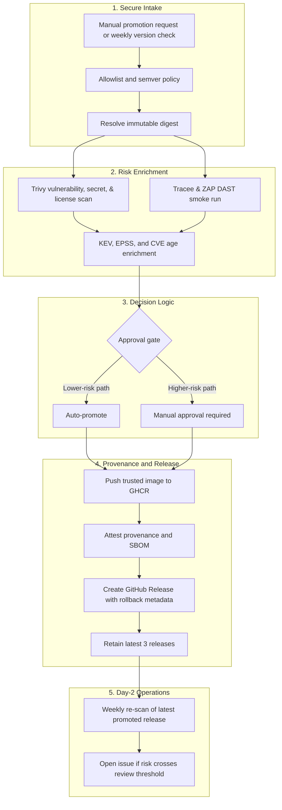

# Secure Deploy: Reference Architecture for Vendor Image Promotion

[](https://github.com/llody9977/secure-ci-deploy/actions/workflows/ci.yml)
[](https://github.com/llody9977/secure-ci-deploy/actions/workflows/image-promotion.yml)
[](https://github.com/llody9977/secure-ci-deploy/actions/workflows/rescan.yml)

Secure Deploy is a practical reference implementation for promoting third-party container images through a more controlled, evidence-driven pipeline. Where many pipelines stop at "scan the image and count the CVEs," this repository demonstrates how to add supply chain integrity, exploitability context, and runtime hardening to the promotion path itself.

Put differently: this repo is trying to show what vendor image promotion looks like when the goal is not only "ship the image," but "ship the image with enough evidence to justify trust."

The current example workload is `n8nio/n8n`, chosen because it is a realistic application with a meaningful dependency tree and enough package noise to make severity-only decisions unhelpful.

## Industry References

When teams design secure CI/CD and image-promotion workflows, these references are commonly used together:

- `OWASP Top 10 CI/CD Security Risks`
  - useful for identifying common CI/CD attack paths and failure modes
- `NIST SP 800-53`
  - useful for describing the control objectives behind approval, integrity, audit, and least-privilege decisions
- `NIST SP 800-204D`
  - useful for thinking about how supply chain controls fit into a DevSecOps pipeline
- `SLSA`
  - useful for reasoning about artifact integrity, provenance, and build trust

This repository is best read as a practical implementation aligned with parts of those references. It should not be read as a blanket compliance or certification claim.

## The Problem: Why Scans Alone Are Not Enough

Vendor-image promotion pipelines often fail in predictable ways. A raw scan result by itself usually leaves you with the wrong questions answered:

- you know the image has vulnerabilities, but not whether they are likely to be exploited soon
- you know the package exists, but not whether the relevant files were exercised
- you know the vendor published a tag, but not whether you should trust that tag as an immutable release input
- you know the image was acceptable last week, but not whether it is still acceptable today

In practice, that leads to:

- `Tag drift`
  - a mutable upstream tag can change silently
- `dependency chain abuse`
  - the upstream image may be legitimate, but still carry risky dependencies or newly disclosed flaws
- `severity fatigue`
  - teams get long lists of `CRITICAL` and `HIGH` findings without enough context to decide what really needs a hard stop
- `context blindness`
  - a vulnerable package may exist on disk even if the relevant files are not exercised during normal runtime behavior
- `day-2 drift`
  - an image that looked acceptable during promotion can become riskier later as KEV and EPSS data change

This repository exists to address those problems more directly by treating vendor image promotion as a trust and decision problem, not only as a scanning problem.

## Pipeline Architecture



## Threat Model Mapping

This repository is intended to reduce a specific set of CI/CD and vendor-ingestion risks.

| Threat pattern | Why it matters here | Primary control in this repo |
| :--- | :--- | :--- |
| Dependency chain abuse | A trusted vendor image can still introduce risky or newly vulnerable components | digest pinning, Trivy scan, KEV/EPSS/age enrichment |
| Artifact substitution or tag drift | A mutable upstream tag can change without notice | resolve and pin immutable digest before promotion |
| Prohibitive licenses | Vendor images may introduce strict copyleft licenses | Trivy license scanning blocking promotion |
| Runtime misconfigurations | Static scans miss exposed runtime HTTP flaws | OWASP ZAP baseline DAST during smoke run |
| IaC and Script weaknesses | Underlying deployment files may contain configuration errors | Checkov (IaC) and Shellcheck scanning in CI flow |
| Insufficient flow control | High-risk images can move too far through the pipeline without a human decision | `trusted-promotion` environment for manual approval |
| Weak artifact integrity evidence | Teams need more than “the scan passed” to trust a promoted artifact | provenance attestation, SBOM attestation, release evidence |
| Weak pipeline identity model | Long-lived publish credentials increase exposure if leaked | ephemeral `GITHUB_TOKEN` for GHCR actions, short-lived workflow identity for attestation flows |
| Insufficient day-2 monitoring | A previously accepted image can later become more urgent | weekly re-scan of the latest promoted release |
| Runtime over-privilege | A promoted image can still be dangerous if it runs with too much privilege | Docker runtime hardening in `iac/n8n` |
| Action/Workflow Poisoning | An upstream GitHub Action tag could be hijacked (Supply Chain) | strict commit SHA pinning across all workflows |
| Vendor Identity Impersonation | A valid signature could belong to an attacker, not the vendor | strict Cosign OIDC-issuer and identity enforcement |

This means the repository is not only “a scanner pipeline.” It is an attempt to treat vendor image ingestion as a CI/CD and supply-chain trust problem.

## Quick Start

To deploy the latest promoted image to a host:

```bash
git clone https://github.com/llody9977/secure-ci-deploy.git
cd secure-ci-deploy/iac/n8n
chmod +x install.sh
./install.sh
```

To run promotion manually:

1. Open `Actions`
2. Select `Image Promotion (Trusted Source)`
3. Provide a version, or use the default input if you want the workflow to resolve the latest supported upstream version

## Intelligence-Driven Approval Gate

The promotion gate is intentionally not based on CVE severity alone.

### What a CVE does and does not tell you

A `CVE` identifier tells you that a known vulnerability exists. It does not, by itself, fully answer:

- whether the CVE is known to be exploited in the wild
- how likely exploitation is in the near term
- whether the vulnerable code is meaningfully exercised by the workload
- whether the finding is fresh or has remained open long enough to require stricter review

That is why this pipeline layers more than one signal into the approval decision.

### Risk Enrichment Signals

- `CISA KEV`
  - tells you whether the CVE is already known to be exploited in the wild
  - in this repository, KEV acts as the strongest urgency signal for `CRITICAL` and `HIGH` findings

- `EPSS`
  - estimates the probability of exploitation in the next 30 days
  - in this repository, EPSS is used as a probability-based signal for whether a not-yet-KEV finding still deserves manual review

- `CVE age`
  - adds a time dimension so that a “fresh but not yet patched” finding is treated differently from an older exposure

- `Tracee reachability`
  - records runtime exec/load/file evidence during a smoke run
  - used today as analyst context, not as an approval-gate input

- `OWASP ZAP (DAST)`
  - runs a lightweight dynamic baseline scan against the actual container during the Tracee smoke test
  - detects exposed runtime flaws and exports results automatically

### Gate Policy

For `CRITICAL` and `HIGH` findings:

| Finding severity | KEV | EPSS | Age | Action |
| :--- | :--- | :--- | :--- | :--- |
| `CRITICAL` / `HIGH` | Yes | Any | Any | Manual review |
| `CRITICAL` / `HIGH` | No | Above repo threshold | Any | Manual review |
| `CRITICAL` / `HIGH` | No | Below repo threshold | At least 30 days | Manual review |
| `CRITICAL` / `HIGH` | No | Below repo threshold | Under 30 days | Auto-promotion allowed |
| `MEDIUM` / `LOW` / `UNKNOWN` | No | Any | Any | Reported, but does not directly trigger manual approval |

**Additional Hard Gates:**
- `Prohibitive Licenses`: The pipeline evaluates images for non-compliant copyleft licenses (via Trivy). If restricted licenses are present, promotion is immediately blocked.
- `Malware & Secrets`: Promotion is blocked unconditionally if embedded secrets (Trivy) or known malware signatures (ClamAV) are detected.
- `IaC/Configuration`: Separate PR workflows run `Checkov` against `docker-compose.yml` and `Shellcheck` against bash scripts to ensure robust deployment policies.

The intended interpretation is:

- `KEV` is the urgency signal
- `EPSS` is the probability signal
- `CVE age` is the tolerance-window signal

### EPSS Policy Bands

The labels below are repository policy thresholds, not official EPSS categories.

Example: an EPSS score of `2.1%` means an estimated `2.1%` probability of exploitation in the next 30 days. In this repository, that is above the `2.0%` manual-review threshold for `CRITICAL` and `HIGH` findings.

| EPSS score | Repository policy band | Meaning | Action |
| :--- | :--- | :--- | :--- |
| `< 0.5%` | Low | Exploitation currently looks unlikely at scale | Does not block auto-promotion by itself |
| `0.5% to < 2.0%` | Medium | Elevated likelihood, but below manual-review threshold | May still auto-promote if other checks are clear |
| `2.0% to < 10.0%` | High | Above this repository's manual-review threshold | Manual review for `CRITICAL` and `HIGH` findings |
| `>= 10.0%` | Critical | Very high predicted exploitation likelihood | Treat as urgent; manual review for `CRITICAL` and `HIGH` findings |

## Reachability and the False-Positive Problem

Traditional image scanning tells you vulnerable code is present in the image. It does not tell you whether the relevant code path is actually exercised by the running workload.

That matters because one of the hardest problems in vulnerability management is false-positive prioritization:

- vulnerable package exists on disk
- but the package may not be materially exercised in the runtime path you care about

This repository uses Tracee during a smoke run to add runtime context such as file loads and executable use. The goal is to move from:

- “vulnerable package exists”

toward:

- “vulnerable package exists and related files were observed during execution”

Current status:

- reachability is reported in vulnerability summaries as `Yes/No`
- reachability is useful analyst context
- reachability is not currently used as an approval-gate parameter

TODO:

- verify that the current Tracee-based reachability approach is reliable enough across the supported image and runtime combinations
- only consider using it in the approval gate after that verification work is complete

## Identity, Trust, and Attestation

This repository avoids long-lived registry credentials in the promotion path where possible.

Current model:

- GHCR authentication uses the repository-scoped ephemeral `GITHUB_TOKEN`
- attestation flows use GitHub Actions `id-token: write`
- build provenance and SBOM attestation are produced in the GitHub Actions promotion path
- all GitHub Actions workflow steps are strictly pinned to immutable commit SHAs to prevent upstream injection over mutable tags

In practical terms:

- the publish path does not depend on a stored long-lived registry password or personal access token for the normal GHCR workflow
- the promoted artifact path treats GitHub Actions as the controlled builder and attestation environment for this repository

This is stronger than a static credential model, but it should still be described as the current repository design, not as a universal zero-trust guarantee across every connected system.

## Framework Alignment

These frameworks are useful here as explanatory lenses, not as blanket compliance claims.

### OWASP Top 10 CI/CD Security Risks

Use in this repo:

- frames the pipeline as a threat surface, not just a delivery mechanism
- helps explain why flow control, artifact integrity, identity, and visibility matter

Concrete examples in this repo:

- workflow separation and manual approval for higher-risk paths
- digest pinning before promotion
- attestation and release evidence for visibility and integrity
- latest-release re-scan for day-2 monitoring

### NIST SP 800-53

Use in this repo:

- provides the control vocabulary behind access control, integrity, auditability, and least privilege

Concrete examples in this repo:

- manual approval in `trusted-promotion`
- policy-as-code and version constraints
- workflow artifacts, summaries, and releases
- runtime least-privilege settings in the hardened compose stack

This repository does not claim full NIST SP 800-53 implementation. It applies a practical subset of ideas relevant to image promotion and deployment.

### NIST SP 800-204D

Use in this repo:

- helps explain how software supply chain controls can be embedded into a DevSecOps pipeline rather than applied as an afterthought

Concrete examples in this repo:

- policy-driven intake
- artifact-centric promotion decisions around digests, SBOMs, and provenance
- scheduled re-scan of the active promoted release

This repository is better described as aligned with parts of that guidance than as a complete implementation claim.

### SLSA

Use in this repo:

- helps explain artifact trust, provenance, and promotion integrity

Concrete examples in this repo:

- immutable digest pinning
- provenance attestation for promoted images
- SBOM attestation
- release evidence tied to the promoted artifact

Current maturity statement:

- the promoted artifact path is designed to align most closely with `SLSA Level 3` concepts
- this should not be read as an independent certification or a claim over every upstream dependency or external platform boundary

Why that is the closest fit:

- provenance is generated in the GitHub Actions promotion path
- promoted artifacts are tied to immutable digests
- attestation and release evidence are preserved for verification and audit use

## Docker Hardening

Docker hardening is not the same thing as supply chain integrity, but it is still part of the overall risk model.

How to think about the split:

- supply chain controls answer: “Can I trust what artifact I am promoting?”
- approval-gate controls answer: “Is the current risk low enough for automation?”
- Docker hardening answers: “If the workload or image is compromised, how much damage can the container do?”

In this repository, runtime hardening contributes by:

- dropping capabilities with `cap_drop: ALL`
- limiting privilege escalation with `no-new-privileges`
- using a read-only root filesystem where practical
- preferring non-root execution
- constraining CPU and memory
- applying AppArmor and related runtime restrictions

Docker hardening does not raise SLSA maturity by itself. It complements the supply chain controls by reducing runtime blast radius after deployment.

## Day-2 Operations

### Weekly Re-Scan

- schedule: every Monday at `00:00 UTC`
- scope: latest promoted release only
- outcome:
  - no action if it remains acceptable under the current gate policy
  - issue creation if it now requires manual review

### Remediation Workflow

When `rescan.yml` opens an issue, the recommended operating response is:

1. triage whether the trigger was KEV, EPSS, CVE age, or a combination
2. decide whether a newer upstream release should be promoted
3. if no acceptable newer version exists, document the exception and risk owner
4. update deployment plans so the latest promoted image is revisited promptly

Suggested response expectation:

- KEV-triggered `CRITICAL` or `HIGH` findings should be treated as immediate human-review items
- EPSS- or age-triggered findings should be handled on an accelerated remediation timeline, even if not yet known exploited

### Artifact Format and Forward Path

Current artifact choices:

- SBOM format: `SPDX JSON`
- provenance: GitHub build provenance and attestation flow
- exploitability: `OpenVEX` JSON document automatically generated to silence unreachable or low-risk CVEs

## Repository Structure

```text
.
├── .github/workflows/
│   ├── ci.yml
│   ├── image-promotion.yml
│   ├── rescan.yml
│   └── weekly-version-check.yml
├── .github/scripts/
│   ├── collect_package_files.sh
│   ├── enrich_findings.py
│   ├── generate_summary.py
│   ├── merge_tracee_reachability.py
│   └── run_tracee_reachability.sh
├── policy/
│   ├── image-ingestion-policy.yml
│   ├── runtime-hardening-policy.yml
│   └── vulnerability-gate-policy.yml
└── iac/n8n/
    ├── .env.template
    ├── docker-compose.yml
    ├── install.sh
    └── upgrade.sh
```

## Deployment and Verification

```bash
git clone https://github.com/llody9977/secure-ci-deploy.git
cd secure-ci-deploy/iac/n8n
chmod +x install.sh
./install.sh
```

`install.sh` supports:

- selecting a target version or latest promoted release
- provenance verification with `gh attestation verify`
- runtime resource limits
- deployment and rollback support
- optional auto-upgrade with `upgrade.sh`

## References

- [CISA KEV](https://www.cisa.gov/known-exploited-vulnerabilities-catalog)
- [CIS Docker Benchmark](https://www.cisecurity.org/benchmark/docker)
- [FIRST EPSS](https://www.first.org/epss/)
- [NIST SP 800-204D](https://csrc.nist.gov/pubs/sp/800/204/d/final)
- [NIST SP 800-53 Rev. 5](https://csrc.nist.gov/pubs/sp/800/53/r5/upd1/final)
- [OWASP Top 10 CI/CD Security Risks](https://owasp.org/www-project-top-10-ci-cd-security-risks/)
- [SLSA v1.0 specification](https://slsa.dev/spec/v1.0/)

This README is descriptive documentation for the current repository behavior. If the workflows or policies change, this document should be updated to match the implementation.
