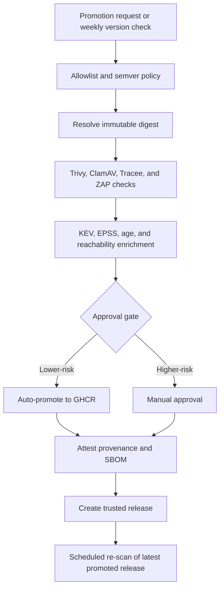

# Secure Deploy: Trusted Vendor Image Promotion for n8n

[](https://github.com/llody9977/secure-ci-deploy/actions/workflows/ci.yml)
[](https://github.com/llody9977/secure-ci-deploy/actions/workflows/image-promotion.yml)
[](https://github.com/llody9977/secure-ci-deploy/actions/workflows/rescan.yml)

Secure Deploy is a reference implementation for promoting third-party container images through a more controlled, evidence-driven pipeline. Instead of trusting a mutable upstream tag, this repo pins an immutable digest, enriches vulnerability results with exploitability context, promotes a trusted image to GHCR, and ships hardened deployment assets for running that image.

The example workload is `n8nio/n8n`. The same pattern is meant to demonstrate how a vendor image can be evaluated as a trust and decision problem, not only as a raw CVE count.

## What This Repo Does

- allowlists the upstream source image and enforces semver-style version intake
- resolves and scans an immutable upstream digest
- enriches findings with `KEV`, `EPSS`, CVE age, and runtime reachability context
- promotes an approved image to `ghcr.io/llody9977/secure-ci-deploy/n8n-trusted`
- attests provenance and SBOM data for the promoted artifact
- re-scans the latest promoted release on a schedule
- provides a hardened Docker Compose deployment for n8n

## Pipeline Flow



## Quick Start

To deploy the latest promoted image to a host:

```bash
git clone https://github.com/llody9977/secure-ci-deploy.git
cd secure-ci-deploy/iac/n8n
chmod +x install.sh
./install.sh
```

The install flow:

- resolves the repo and release to deploy
- verifies provenance when GitHub CLI is available
- writes a deployment `.env`
- starts n8n with external task runners
- supports rollback and optional auto-upgrade

To run image promotion manually:

1. Open `Actions`
2. Select `Image Promotion (Trusted Source)`
3. Enter a version such as `2.14.2`, or leave `latest`

## Documentation

- [Architecture and trust model](/Users/minato/secure-ci-deploy/docs/architecture-and-trust.md)
- [Approval gate policy](/Users/minato/secure-ci-deploy/docs/gate-policy.md)
- [Deployment and operations](/Users/minato/secure-ci-deploy/docs/deployment-and-operations.md)

## Repository Structure

```text
.
├── .github/workflows/
├── .github/scripts/
├── docs/
├── iac/n8n/
└── policy/
```

## Key Paths

- [image-promotion.yml](/Users/minato/secure-ci-deploy/.github/workflows/image-promotion.yml)
- [rescan.yml](/Users/minato/secure-ci-deploy/.github/workflows/rescan.yml)
- [docker-compose.yml](/Users/minato/secure-ci-deploy/iac/n8n/docker-compose.yml)
- [install.sh](/Users/minato/secure-ci-deploy/iac/n8n/install.sh)
- [upgrade.sh](/Users/minato/secure-ci-deploy/iac/n8n/upgrade.sh)

## References

- [OWASP Top 10 CI/CD Security Risks](https://owasp.org/www-project-top-10-ci-cd-security-risks/)
- [NIST SP 800-53 Rev. 5](https://csrc.nist.gov/pubs/sp/800/53/r5/upd1/final)
- [NIST SP 800-204D](https://csrc.nist.gov/pubs/sp/800/204/d/final)
- [SLSA v1.0 specification](https://slsa.dev/spec/v1.0/)
- [CISA KEV](https://www.cisa.gov/known-exploited-vulnerabilities-catalog)
- [FIRST EPSS](https://www.first.org/epss/)
- [CIS Docker Benchmark](https://www.cisecurity.org/benchmark/docker)
